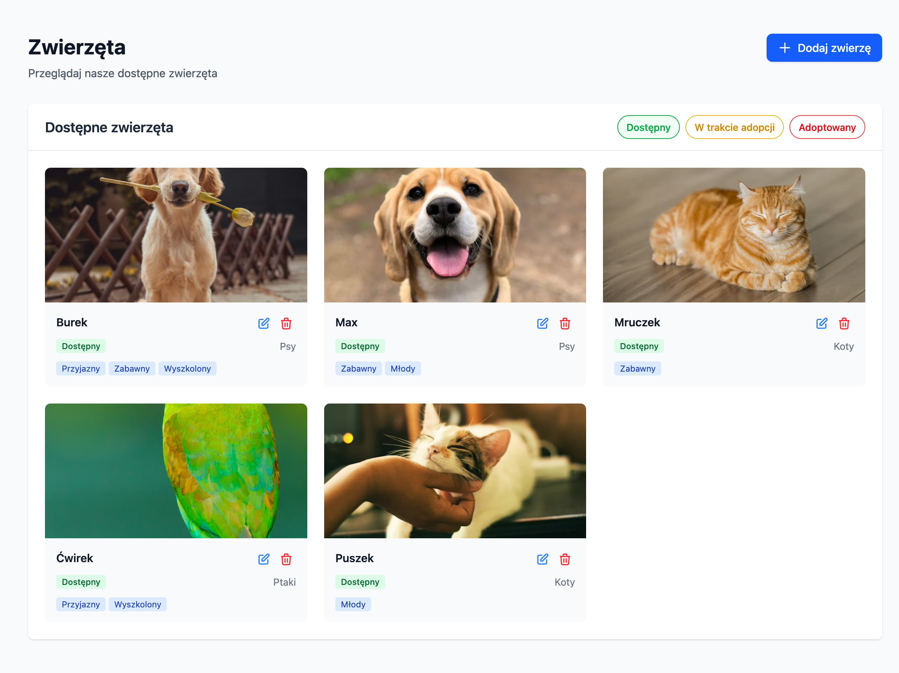

# Larva Laravel Project



## Stack technologiczny

- **Backend:** Laravel 12.x
- **Frontend:** Blade templates + Tailwind CSS
- **Baza danych:** MySQL (via Docker)
- **Środowisko:** Laravel Sail (Docker)

## API Endpoints

- GET /api/pets/findByStatus?status[]=available
- POST /api/pet
- PUT /api/pet
- DELETE /api/pet/{id}
- GET /api/pet/config

## Uruchomienie projektu przy użyciu Laravel Sail

```bash
# Skopiuj plik .env
cp .env.example .env

# Uruchom kontenery Docker
./vendor/bin/sail up

# W osobnym oknie terminala zainstaluj zależności i wygeneruj klucz
./vendor/bin/sail composer install
./vendor/bin/sail artisan key:generate

# Uruchom migracje bazy danych (obowiązkowe do poprawnego działania)
./vendor/bin/sail artisan migrate

# Zainstaluj zależności Node.js i zbuduj assets Tailwind
./vendor/bin/sail npm install
./vendor/bin/sail npm run build
```

Projekt będzie dostępny pod adresem: `http://localhost`

## Uruchomienie testów

```bash
# Uruchom wszystkie testy
./vendor/bin/sail artisan test

# Uruchom testy z pokryciem kodu
./vendor/bin/sail artisan test --coverage
```
